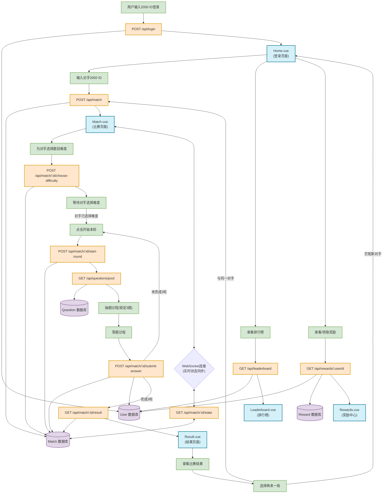

# 前端开发文档

## 程序流程图

以下流程图展示了AI知识竞赛项目的前后端交互和页面之间的关系：

## 流程说明

### 用户登录与匹配流程
1. 用户在Home页面输入2050 ID登录系统
2. 登录成功后，用户输入对手的2050 ID进行匹配
3. 系统创建比赛记录，双方进入Match页面

### 比赛流程
1. 双方互相为对方选择题目难度（易/中/难）
2. 系统通过WebSocket实时同步双方状态
3. 当双方都选择完难度后，可点击"开始本轮"
4. 进入抽题环节，前端从题库中获取50道题目进行滚动展示
5. 用户通过点击锁定3道题目
6. 锁定完成后进入答题环节
7. 答题完成后提交答案，系统计算得分并更新用户积分和题量
8. 完成3轮后，跳转到结果页面

### 结果与奖励流程
1. 结果页面显示比赛结果和奖励情况
2. 用户可选择与同一对手再来一局或匹配新对手
3. 用户可查看排行榜和奖励中心
4. 达到条件的奖励可在奖励中心领取

## 数据流动

- 前端通过API与后端交互，获取和提交数据
- WebSocket用于实时同步双方状态
- 用户数据、比赛记录、题目和奖励信息存储在MongoDB数据库中
- 前端页面之间通过Vue Router进行导航